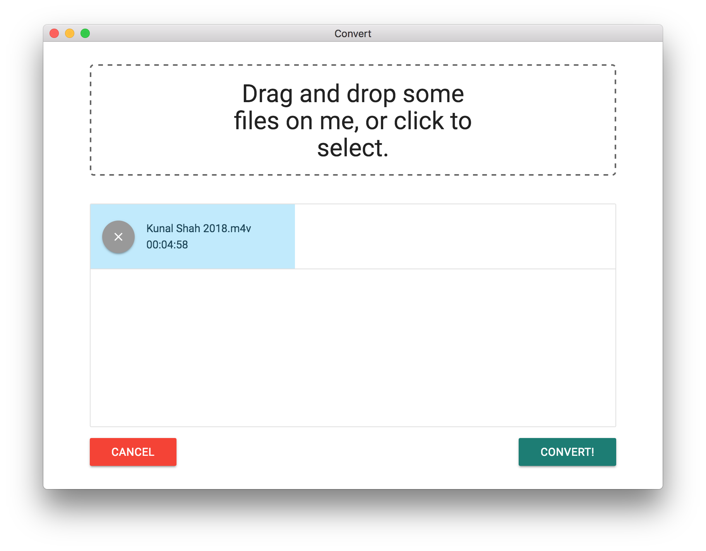

# Electron Video Converter 

A desktop application that converts videos on your desktop into a format of your choice. You can choose between: 

This project was built with [Electron], [React], [Redux], [Webpack], and [Babel] and was informed by Stephen Grider's online course on building [Desktop Apps with Electron](https://www.udemy.com/electron-react-tutorial/)

### Usage

`npm install`

Start dev server:

`npm start`

In a new terminal window:

`npm run electron`

[React]: https://reactjs.org/
[Redux]: https://redux.js.org/
[Electron]: https://electronjs.org
[Webpack]: https://webpack.js.org/
[Babel]: http://babeljs.io/